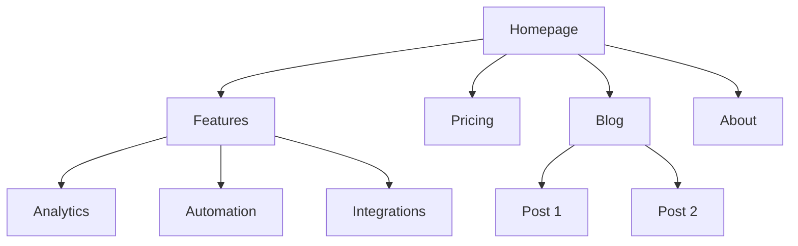
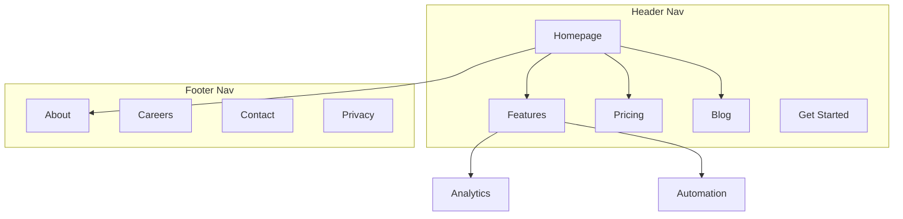

# Page Architect

> **Agent:** Hugo (CRO Specialist) | **Framework:** Landing Page Anatomy + Attention Ratio + Site Architecture (Information Architecture)

**Context:** read the product marketing context first —
`WizardingCode/Marketing/product-marketing.md` in Obsidian (KB-first),
else the project-local `.agents/product-marketing.md`.

## Two Scopes

This skill blueprints structure at two altitudes. Pick the scope from the
request.

| Scope | Question it answers | Deliverable |
|-------|---------------------|-------------|
| **Page** | How should THIS page be laid out? | Landing page wireframe: above-the-fold anatomy, section order, copy blocks, CTA placement, 1:1 attention ratio |
| **Site** | What pages does the site need and how do they connect? | Sitemap, page hierarchy, navigation, URL structure, internal-linking plan |

Page scope is a single-page blueprint; site scope is the whole information
architecture. They compose: architect the site, then blueprint each page.

---

## Landing Page Architecture (page scope)

Structure a single landing page: above-the-fold anatomy, section order,
copy blocks, CTA placement, and an attention ratio of 1:1 (one page, one
goal, one action — no competing links).

The deliverable is a page wireframe with:
- **Section order** — the sequence from hero to final CTA.
- **Copy blocks** — what each section must say (the message, not the final copy — that's `landing/copy-framework`).
- **CTA placement** — where the single conversion action appears and repeats.
- **Attention ratio** — 1:1 on a conversion page; strip nav and outbound links that leak attention.

This is a blueprint, not code (`landing/landing-gen` builds) and not final
copy (`landing/copy-framework` writes).

---

## Site Architecture (site scope)

Plan the whole website's structure — page hierarchy, navigation, URL
patterns, and internal linking — so the site is intuitive for users and
optimized for search engines.

### Inputs (ask if not provided)

**Business context:**
- What does the company do?
- Who are the primary audiences?
- Top 3 goals for the site? (conversions, SEO traffic, education, support)

**Current state:**
- New site or restructuring an existing one?
- If restructuring: what's broken? (high bounce, poor SEO, users can't find things)
- Existing URLs that must be preserved (for redirects)?

**Site type:**
- SaaS marketing site
- Content/blog site
- E-commerce
- Documentation
- Hybrid (SaaS + content)
- Small business / local

**Content inventory:**
- How many pages exist or are planned?
- Which are the most important? (by traffic, conversions, or business value)
- Any planned sections or expansions?

### Site types and starting points

| Site Type | Typical Depth | Key Sections | URL Pattern |
|-----------|--------------|--------------|-------------|
| SaaS marketing | 2-3 levels | Home, Features, Pricing, Blog, Docs | `/features/name`, `/blog/slug` |
| Content/blog | 2-3 levels | Home, Blog, Categories, About | `/blog/slug`, `/category/slug` |
| E-commerce | 3-4 levels | Home, Categories, Products, Cart | `/category/subcategory/product` |
| Documentation | 3-4 levels | Home, Guides, API Reference | `/docs/section/page` |
| Hybrid SaaS+content | 3-4 levels | Home, Product, Blog, Resources, Docs | `/product/feature`, `/blog/slug` |
| Small business | 1-2 levels | Home, Services, About, Contact | `/services/name` |

**For full page hierarchy templates**: See [references/site-type-templates.md](references/site-type-templates.md)

### Page hierarchy design

#### The 3-click rule

Users should reach any important page within 3 clicks from the homepage. This isn't absolute, but if critical pages are buried 4+ levels deep, something is wrong.

#### Flat vs deep

| Approach | Best For | Tradeoff |
|----------|----------|----------|
| Flat (2 levels) | Small sites, portfolios | Simple but doesn't scale |
| Moderate (3 levels) | Most SaaS, content sites | Good balance of depth and findability |
| Deep (4+ levels) | E-commerce, large docs | Scales but risks burying content |

**Rule of thumb**: go as flat as possible while keeping navigation clean. If a nav dropdown has 20+ items, add a level of hierarchy.

#### Hierarchy levels

| Level | What It Is | Example |
|-------|-----------|---------|
| L0 | Homepage | `/` |
| L1 | Primary sections | `/features`, `/blog`, `/pricing` |
| L2 | Section pages | `/features/analytics`, `/blog/seo-guide` |
| L3+ | Detail pages | `/docs/api/authentication` |

#### ASCII tree format

Use this format for page hierarchies:

```
Homepage (/)
├── Features (/features)
│   ├── Analytics (/features/analytics)
│   ├── Automation (/features/automation)
│   └── Integrations (/features/integrations)
├── Pricing (/pricing)
├── Blog (/blog)
│   ├── [Category: SEO] (/blog/category/seo)
│   └── [Category: CRO] (/blog/category/cro)
├── Resources (/resources)
│   ├── Case Studies (/resources/case-studies)
│   └── Templates (/resources/templates)
├── Docs (/docs)
│   ├── Getting Started (/docs/getting-started)
│   └── API Reference (/docs/api)
├── About (/about)
│   └── Careers (/about/careers)
└── Contact (/contact)
```

**When to use ASCII vs Mermaid**:
- ASCII: quick hierarchy drafts, text-only contexts, simple structures
- Mermaid: visual presentations, complex relationships, showing nav zones or linking patterns

### Navigation design

#### Navigation types

| Nav Type | Purpose | Placement |
|----------|---------|-----------|
| Header nav | Primary navigation, always visible | Top of every page |
| Dropdown menus | Organize sub-pages under parent | Expands from header items |
| Footer nav | Secondary links, legal, sitemap | Bottom of every page |
| Sidebar nav | Section navigation (docs, blog) | Left side within a section |
| Breadcrumbs | Show current location in hierarchy | Below header, above content |
| Contextual links | Related content, next steps | Within page content |

#### Header navigation rules

- **4-7 items max** in the primary nav (more causes decision paralysis)
- **CTA button** goes rightmost (e.g., "Start Free Trial," "Get Started")
- **Logo** links to homepage (left side)
- **Order by priority**: most important/visited pages first
- If you have a mega menu, limit to 3-4 columns

#### Footer organization

Group footer links into columns:
- **Product**: Features, Pricing, Integrations, Changelog
- **Resources**: Blog, Case Studies, Templates, Docs
- **Company**: About, Careers, Contact, Press
- **Legal**: Privacy, Terms, Security

#### Breadcrumb format

```
Home > Features > Analytics
Home > Blog > SEO Category > Post Title
```

Breadcrumbs should mirror the URL hierarchy. Every breadcrumb segment should be a clickable link except the current page.

**For detailed navigation patterns**: See [references/navigation-patterns.md](references/navigation-patterns.md)

### URL structure

#### Design principles

1. **Readable by humans** — `/features/analytics` not `/f/a123`
2. **Hyphens, not underscores** — `/blog/seo-guide` not `/blog/seo_guide`
3. **Reflect the hierarchy** — URL path should match site structure
4. **Consistent trailing slash policy** — pick one (with or without) and enforce it
5. **Lowercase always** — `/About` should redirect to `/about`
6. **Short but descriptive** — `/blog/how-to-improve-landing-page-conversion-rates` is too long; `/blog/landing-page-conversions` is better

#### URL patterns by page type

| Page Type | Pattern | Example |
|-----------|---------|---------|
| Homepage | `/` | `example.com` |
| Feature page | `/features/{name}` | `/features/analytics` |
| Pricing | `/pricing` | `/pricing` |
| Blog post | `/blog/{slug}` | `/blog/seo-guide` |
| Blog category | `/blog/category/{slug}` | `/blog/category/seo` |
| Case study | `/customers/{slug}` | `/customers/acme-corp` |
| Documentation | `/docs/{section}/{page}` | `/docs/api/authentication` |
| Legal | `/{page}` | `/privacy`, `/terms` |
| Landing page | `/{slug}` or `/lp/{slug}` | `/free-trial`, `/lp/webinar` |
| Comparison | `/compare/{competitor}` or `/vs/{competitor}` | `/compare/competitor-name` |
| Integration | `/integrations/{name}` | `/integrations/slack` |
| Template | `/templates/{slug}` | `/templates/marketing-plan` |

#### Common mistakes

- **Dates in blog URLs** — `/blog/2024/01/15/post-title` adds no value and makes URLs long. Use `/blog/post-title`.
- **Over-nesting** — `/products/category/subcategory/item/detail` is too deep. Flatten where possible.
- **Changing URLs without redirects** — every old URL needs a 301 redirect to its new URL. Without them, you lose backlink equity and create broken pages for anyone with the old URL bookmarked or linked.
- **IDs in URLs** — `/product/12345` is not human-readable. Use slugs.
- **Query parameters for content** — `/blog?id=123` should be `/blog/post-title`.
- **Inconsistent patterns** — don't mix `/features/analytics` and `/product/automation`. Pick one parent.

#### Breadcrumb-URL alignment

The breadcrumb trail should mirror the URL path:

| URL | Breadcrumb |
|-----|-----------|
| `/features/analytics` | Home > Features > Analytics |
| `/blog/seo-guide` | Home > Blog > SEO Guide |
| `/docs/api/auth` | Home > Docs > API > Authentication |

### Visual sitemap output (Mermaid)

Use Mermaid `graph TD` for visual sitemaps. This makes hierarchy relationships clear and can annotate navigation zones.

#### Basic hierarchy



#### With navigation zones



**For more Mermaid templates**: See [references/mermaid-templates.md](references/mermaid-templates.md)

### Internal linking strategy

#### Link types

| Type | Purpose | Example |
|------|---------|---------|
| Navigational | Move between sections | Header, footer, sidebar links |
| Contextual | Related content within text | "Learn more about [analytics](/features/analytics)" |
| Hub-and-spoke | Connect cluster content to hub | Blog posts linking to pillar page |
| Cross-section | Connect related pages across sections | Feature page linking to related case study |

#### Internal linking rules

1. **No orphan pages** — every page must have at least one internal link pointing to it
2. **Descriptive anchor text** — "our analytics features" not "click here"
3. **5-10 internal links per 1000 words** of content (approximate guideline)
4. **Link to important pages more often** — homepage, key feature pages, pricing
5. **Use breadcrumbs** — free internal links on every page
6. **Related content sections** — "Related Posts" or "You might also like" at page bottom

#### Hub-and-spoke model

For content-heavy sites, organize around hub pages:

```
Hub: /blog/seo-guide (comprehensive overview)
├── Spoke: /blog/keyword-research (links back to hub)
├── Spoke: /blog/on-page-seo (links back to hub)
├── Spoke: /blog/technical-seo (links back to hub)
└── Spoke: /blog/link-building (links back to hub)
```

Each spoke links back to the hub. The hub links to all spokes. Spokes link to each other where relevant.

#### Link audit checklist

- [ ] Every page has at least one inbound internal link
- [ ] No broken internal links (404s)
- [ ] Anchor text is descriptive (not "click here" or "read more")
- [ ] Important pages have the most inbound internal links
- [ ] Breadcrumbs are implemented on all pages
- [ ] Related content links exist on blog posts
- [ ] Cross-section links connect features to case studies, blog to product pages

### Output format (site plan deliverables)

When creating a site architecture plan, provide these deliverables:

**1. Page hierarchy (ASCII tree)** — full site structure with URLs at each node. Use the ASCII tree format from the Page hierarchy design section.

**2. Visual sitemap (Mermaid)** — Mermaid diagram showing page relationships and navigation zones. Use `graph TD` with subgraphs for nav zones where helpful.

**3. URL map table**

| Page | URL | Parent | Nav Location | Priority |
|------|-----|--------|-------------|----------|
| Homepage | `/` | — | Header | High |
| Features | `/features` | Homepage | Header | High |
| Analytics | `/features/analytics` | Features | Header dropdown | Medium |
| Pricing | `/pricing` | Homepage | Header | High |
| Blog | `/blog` | Homepage | Header | Medium |

**4. Navigation spec**
- Header nav items (ordered, with CTA)
- Footer sections and links
- Sidebar nav (if applicable)
- Breadcrumb implementation notes

**5. Internal linking plan**
- Hub pages and their spokes
- Cross-section link opportunities
- Orphan page audit (if restructuring)
- Recommended links per key page

### Task-specific questions

1. Is this a new site or are you restructuring an existing one?
2. What type of site is it? (SaaS, content, e-commerce, docs, hybrid, small business)
3. How many pages exist or are planned?
4. What are the 5 most important pages on the site?
5. Are there existing URLs that need to be preserved or redirected?
6. Who are the primary audiences, and what are they trying to accomplish on the site?

---

## Related ArkaOS skills

- **`landing/copy-framework`** — the section copy for each page
- **`landing/optimize-page`** — optimizing individual pages for conversion (CRO)
- **`landing/landing-gen`** — production build of the page structure
- **`mkt/programmatic-seo`** — building SEO pages at scale with templates and data
- **`mkt/seo-audit`** — technical SEO, on-page optimization, and indexation
- **`mkt/schema-markup`** — breadcrumb and site-navigation structured data
- **`content/content-system`** — planning what content to create and topic clusters

## Output → Obsidian

- **Page scope:** page wireframe (section order, copy blocks, CTA placement) → `WizardingCode/Landing-Pages/Wireframes/PAGE-<slug>.md`
- **Site scope:** site architecture plan (hierarchy, sitemap, URL map, nav spec, linking plan) → `WizardingCode/Landing-Pages/Architecture/SITE-<slug>.md`
